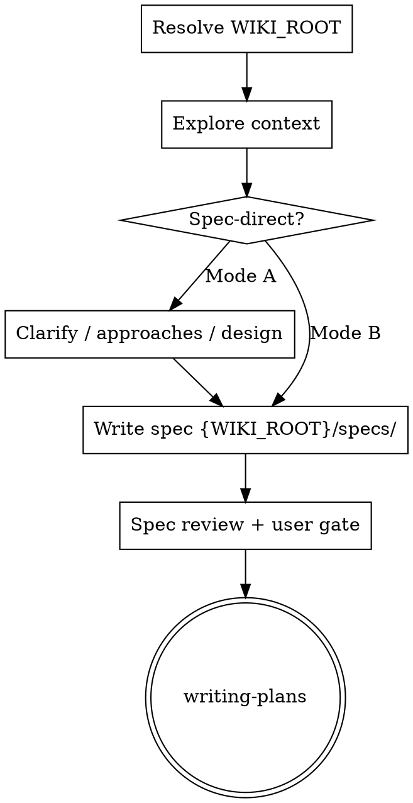

# Brainstorming → Spec (then Plan → Implement)

Help turn ideas into fully formed designs and **specs** through collaborative dialogue — or consolidate an already-clear conversation into a spec.

**Before any path write:** resolve `WIKI_ROOT` and `AGENTS_LAW` per [`../_paths.md`](../_paths.md).

**Pipeline (constitution):** `(brainstorm?) → spec → plan → implement`

- **Brainstorm** is the default when intent/design is still fuzzy.
- **Spec-direct** is allowed when you and the user already aligned in conversation (or the user says to skip brainstorming / “just write the spec”).
- **Never** skip to implementation. Spec (approved) → `writing-plans` → plan (approved) → implement (TDD).

### Canon paths (resolved)

| Artifact | Path |
|---|---|
| Specs | `{WIKI_ROOT}/specs/YYYY-MM-DD-<slug>-spec.md` |
| Plans | `{WIKI_ROOT}/plans/YYYY-MM-DD-<slug>-plan.md` (via writing-plans) |
| Lessons | `{WIKI_ROOT}/plans/lessons.md` |
| Live wiki | `{WIKI_ROOT}/{ARCHITECTURE,SYSTEMS,ORCHESTRATIONS,FRONTEND,PERSISTENCE,SECURITY}.md` |

Do **not** write to `docs/superpowers/` or other legacy locations.

<HARD-GATE>
Do NOT write production code, scaffold features, or invoke implementation skills until:
1. An approved **spec** exists on disk, and
2. The **writing-plans** skill has produced an approved **plan**.

Brainstorm dialogue may be skipped; the spec + plan gates may not.
</HARD-GATE>

## Anti-Pattern: "This Is Too Simple To Need A Spec"

Every non-trivial change gets at least a short spec. The design can be a few sentences, but it must be written and approved.

Trivial typos / one-line obvious fixes may skip this pipeline when the user explicitly treats them as such — prefer asking once if unsure.

## Entry Modes

### Mode A — Full brainstorm (default)

Use when: creative work, multiple valid approaches, unclear requirements, or the user asks to brainstorm.

### Mode B — Spec-direct (brainstorm optional)

Use when the user skips brainstorming / “write the spec” / conversation already produced a clear design.

Still required: restate design → write spec under `{WIKI_ROOT}/specs/` → review gates → **writing-plans** only.

### Trigger phrases (Mode B)

- “write the spec”, “create a spec from our conversation”
- “skip brainstorming” / “skip the Q&A”
- “Mode B”, “we already decided”

### Which skill file to follow

**Prefer this project skill** (`.cursor/skills/brainstorming/` or `.claude/skills/brainstorming/`) when present.  
Do **not** follow personal/old copies with hardcoded product paths unless the user explicitly names them.

### Resume from prior chat

1. Summarize locked decisions (do not re-ask).  
2. Ask only remaining gaps (one at a time).  
3. Final 1–2 low-risk locks may be batched if the user asks.

---

## Checklist

1. **Resolve paths** — read [`../_paths.md`](../_paths.md); note `WIKI_ROOT`.  
2. **Explore context** — code, `{WIKI_ROOT}` wiki, recent commits; respect `AGENTS_LAW` (Prime Directive, Atomic Design, TDD).  
3. **Offer visual companion** (if visual questions) — own message only.  
4. **Clarify** — one at a time (unless final gap batch).  
5. **2–3 approaches** + recommendation.  
6. **Present design** — include **Out of scope (with why)**.  
7. **Write spec** — `{WIKI_ROOT}/specs/YYYY-MM-DD-<slug>-spec.md`  
8. **Spec review loop** — [spec-document-reviewer-prompt.md](spec-document-reviewer-prompt.md)  
9. **User reviews spec**  
10. **Handoff** — writing-plans only  

Mode B: after explore + design confirm → jump to write spec.

---

## Process Flow



**Terminal state = writing-plans.**

---

## Design & standing questions

Cover: architecture (BCs / aggregates / ports), Atomic Design if UI, data flow, errors, TDD.  
**Out of scope (with why)** — required.  
Standing questions from `AGENTS_LAW` §0 (new BC? one writer? typed handovers? judgment vs mechanism? duplicated spine? trust?).

---

## Spec skeleton

Write `{WIKI_ROOT}/specs/YYYY-MM-DD-<slug>-spec.md`:

```markdown
# Spec: <Title>
**Date:** YYYY-MM-DD
**Status:** Draft | Approved
**Ticket / slug:** <SLUG>
## Goal
## Non-goals
## Current state
## Proposed design
## Boundaries
## Trust / tenancy notes
## TDD / test plan
## Success criteria
## Open questions
```

Hubs/spokes stay snapshots — link the spec later; don’t paste history into Architecture.

**User gate:** Spec written to `<path>`. Review before the implementation plan.

---

## Key Principles

One question at a time · multiple choice preferred · YAGNI · explore alternatives in Mode A · spec + plan before code · flexible

## Visual Companion

See [visual-companion.md](visual-companion.md). Offer in an **own message only** when visuals will help.
