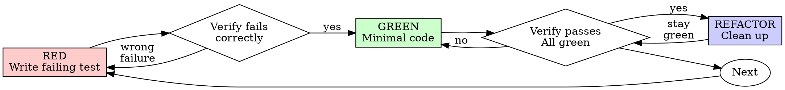

# Test-Driven Development (TDD)

## Overview

Write the test first. Watch it fail. Write minimal code to pass.

**Core principle:** If you didn't watch the test fail, you don't know if it tests the right thing.

**Violating the letter of the rules is violating the spirit of the rules.**

**Constitution:** TDD is mandatory for every code change (`AGENTS_LAW` §3 — resolve via [`../_paths.md`](../_paths.md)). Untested production code is a weak link by definition.

## When to Use

**Always:**
- New features
- Bug fixes
- Refactoring
- Behavior changes
- Any task from `writing-plans` that produces code

**Exceptions (ask your human partner):**
- Throwaway prototypes
- Generated code
- Configuration-only / pure docs moves (no behavior)

Thinking "skip TDD just this once"? Stop. That's rationalization.

## The Iron Law

```
NO PRODUCTION CODE WITHOUT A FAILING TEST FIRST
```

Write code before the test? Delete it. Start over.

**No exceptions:**
- Don't keep it as "reference"
- Don't "adapt" it while writing tests
- Don't look at it
- Delete means delete

Implement fresh from tests. Period.

## Red-Green-Refactor



### RED - Write Failing Test

Write one minimal test showing what should happen.

<Good>
```typescript
test('retries failed operations 3 times', async () => {
  let attempts = 0;
  const operation = () => {
    attempts++;
    if (attempts < 3) throw new Error('fail');
    return 'success';
  };

  const result = await retryOperation(operation);

  expect(result).toBe('success');
  expect(attempts).toBe(3);
});
```
Clear name, tests real behavior, one thing
</Good>

<Bad>
```typescript
test('retry works', async () => {
  const mock = jest.fn()
    .mockRejectedValueOnce(new Error())
    .mockRejectedValueOnce(new Error())
    .mockResolvedValueOnce('success');
  await retryOperation(mock);
  expect(mock).toHaveBeenCalledTimes(3);
});
```
Vague name, tests mock not code
</Bad>

**Requirements:**
- One behavior
- Clear name
- Real code (no mocks unless unavoidable)

### Verify RED - Watch It Fail

**MANDATORY. Never skip.**

```bash
npm test path/to/test.test.ts
```

Confirm:
- Test fails (not errors)
- Failure message is expected
- Fails because feature missing (not typos)

**Test passes?** You're testing existing behavior. Fix test.

**Test errors?** Fix error, re-run until it fails correctly.

### GREEN - Minimal Code

Write simplest code to pass the test. Don't add features, refactor other code, or "improve" beyond the test.

### Verify GREEN - Watch It Pass

**MANDATORY.** Confirm test passes, other tests still pass, output pristine.

### REFACTOR - Clean Up

After green only: remove duplication, improve names, extract helpers. Keep tests green. Don't add behavior.

## Good Tests

| Quality | Good | Bad |
|---------|------|-----|
| **Minimal** | One thing. "and" in name? Split it. | `test('validates email and domain and whitespace')` |
| **Clear** | Name describes behavior | `test('test1')` |
| **Shows intent** | Demonstrates desired API | Obscures what code should do |

## Common Rationalizations

| Excuse | Reality |
|--------|---------|
| "Too simple to test" | Simple code breaks. Test takes 30 seconds. |
| "I'll test after" | Tests passing immediately prove nothing. |
| "Already manually tested" | Ad-hoc ≠ systematic. |
| "Deleting X hours is wasteful" | Sunk cost. Keeping unverified code is debt. |
| "Keep as reference, write tests first" | You'll adapt it. Delete means delete. |
| "TDD will slow me down" | Faster than debugging production. |

## Red Flags - STOP and Start Over

- Code before test / test after implementation / test passes immediately
- Can't explain why test failed / rationalizing "just this once"
- "Keep as reference" or "adapt existing code"

**All of these mean: Delete code. Start over with TDD.**

## Verification Checklist

Before marking work complete:

- [ ] Every new function/method has a test
- [ ] Watched each test fail before implementing
- [ ] Each test failed for expected reason (feature missing, not typo)
- [ ] Wrote minimal code to pass each test
- [ ] All tests pass; output pristine
- [ ] Real code preferred (mocks only if unavoidable)
- [ ] Edge cases and errors covered

## When Stuck

| Problem | Solution |
|---------|----------|
| Don't know how to test | Write wished-for API. Write assertion first. Ask your human partner. |
| Test too complicated | Design too complicated. Simplify interface. |
| Must mock everything | Code too coupled. Use dependency injection. |

## Debugging Integration

Bug found? Write failing test reproducing it. Follow TDD. Never fix bugs without a test.

## Testing Anti-Patterns

When adding mocks or test utilities, read [testing-anti-patterns.md](testing-anti-patterns.md).

## Final Rule

```
Production code → test exists and failed first
Otherwise → not TDD
```

No exceptions without your human partner's permission.
